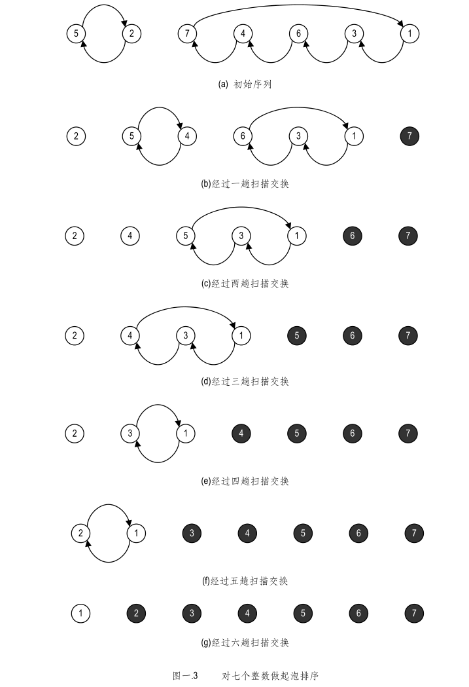

```java

//冒泡排序
//每次排序会将最大值移到后面
//for arr.length-1
//for arr.length-i-1
//  swap()
public void sort(int[] arr) {
    for (int i = 0; i < arr.length - 1; i++) {
        for (int j = 0; j < arr.length - i - 1; j++) {
            if (arr[j] > arr[j + 1]) {
                int tmp = arr[j];
                arr[j] = arr[j + 1];
                arr[j + 1] = tmp;
            }
        }
    }
}

```
