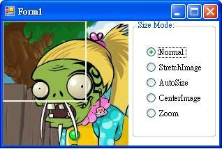
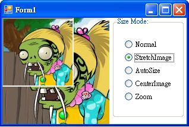
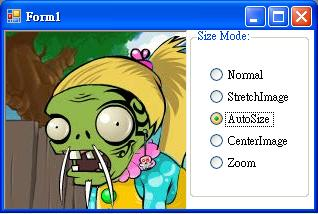
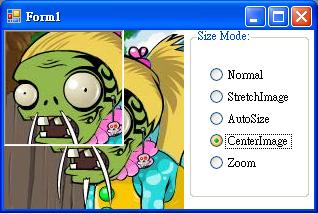
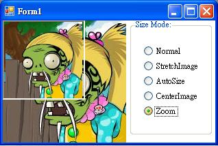

```csharp
pictureBox.SizeMode = PictureBoxSizeMode.Normal;
pictureBox.SizeMode = PictureBoxSizeMode.StretchImage;
pictureBox.SizeMode = PictureBoxSizeMode.AutoSize;
pictureBox.SizeMode = PictureBoxSizeMode.CenterImage;
pictureBox.SizeMode = PictureBoxSizeMode.Zoom;
```




在 Normal 模式中，Image 置于 PictureBox 的左上角，凡是因过大而不适合 PictureBox 的任何图像部分都将被剪裁掉。
* * * * *




使用 StretchImage 值会使图像拉伸或收缩，以便适合 PictureBox。
* * * * *




使用 AutoSize 值会使控件调整大小，以便总是适合图像的大小。
* * * * *




使用 CenterImage 值会使图像居于工作区的中心。
* * * * *




使用 Zoom 的值可以使图像被拉伸或收缩以适应 PictureBox；但是仍然保持原始纵横比。


picturebox.Load ("xxx.jpg")这种来载入图片的话
用image.location是可以得到图片路径的。


