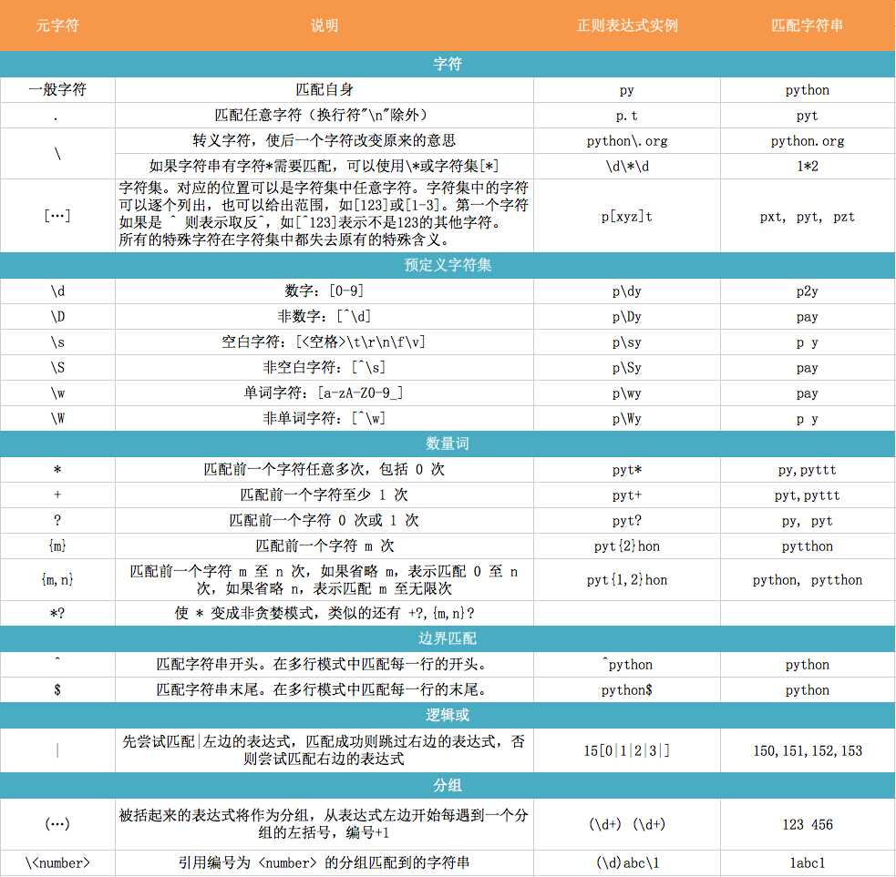

[参考文档 正则表达式入门](http://deerchao.net/tutorials/regex/regex.htm)

[实用正则表达式匹配和替换](http://www.cnblogs.com/Mainz/archive/2009/03/14/1411359.html)





## 在`VSCode`中使用正则表达式替换
将 `<li>` 替换成 `<li> item` --> `(<li>)` `$1 item `


<table style="width: 710px;" border="1" cellspacing="0" cellpadding="2">
    <tbody>
        <tr>
            <td valign="top" width="203">
                <p>
                    <strong>
                        <span style="color: #008000;">字符</span>
                    </strong>
                </p>
            </td>
            <td valign="top" width="505">
                <p>
                    <strong>
                        <span style="color: #008000;">描述</span>
                    </strong>
                </p>
            </td>
        </tr>
        <tr>
            <td valign="top" width="205">
                <em>\</em>
            </td>
            <td valign="top" width="503">将下一个字符标记为一个特殊字符、或一个原义字符、或一个 向后引用、或一个八进制转义符。例如，'n' 匹配字符 "n"。'\n' 匹配一个换行符。序列 '\\' 匹配 "\" 而 "\(" 则匹配 "("。</td>
        </tr>
        <tr>
            <td valign="top" width="207">
                <em>^</em>
            </td>
            <td valign="top" width="502">匹配输入字符串的开始位置。如果设置了 RegExp 对象的 Multiline 属性，^ 也匹配 '\n' 或 '\r' 之后的位置。</td>
        </tr>
        <tr>
            <td valign="top" width="208">
                <em>$</em>
            </td>
            <td valign="top" width="501">匹配输入字符串的结束位置。如果设置了RegExp 对象的 Multiline 属性，$ 也匹配 '\n' 或 '\r' 之前的位置。</td>
        </tr>
        <tr>
            <td valign="top" width="209">
                <em>*</em>
            </td>
            <td valign="top" width="500">匹配前面的子表达式零次或多次。例如，zo* 能匹配 "z" 以及 "zoo"。* 等价于{0,}。</td>
        </tr>
        <tr>
            <td valign="top" width="210">
                <em>+</em>
            </td>
            <td valign="top" width="500">匹配前面的子表达式一次或多次。例如，'zo+' 能匹配 "zo" 以及 "zoo"，但不能匹配 "z"。+ 等价于 {1,}。</td>
        </tr>
        <tr>
            <td valign="top" width="210">
                <em>?</em>
            </td>
            <td valign="top" width="500">匹配前面的子表达式零次或一次。例如，"do(es)?" 可以匹配 "do" 或 "does" 中的"do" 。? 等价于 {0,1}。</td>
        </tr>
        <tr>
            <td valign="top" width="210">{
                <em>n</em>}</td>
            <td valign="top" width="500">
                <em>n</em> 是一个非负整数。匹配确定的
                <em>n</em> 次。例如，'o{2}' 不能匹配 "Bob" 中的 'o'，但是能匹配 "food" 中的两个 o。</td>
        </tr>
        <tr>
            <td valign="top" width="210">{
                <em>n,</em>}</td>
            <td valign="top" width="500">
                <em>n</em> 是一个非负整数。至少匹配
                <em>n</em> 次。例如，'o{2,}' 不能匹配 "Bob" 中的 'o'，但能匹配 "foooood" 中的所有 o。'o{1,}' 等价于 'o+'。'o{0,}' 则等价于 'o*'。</td>
        </tr>
        <tr>
            <td valign="top" width="210">{
                <em>n</em>,
                <em>m</em>}</td>
            <td valign="top" width="500">
                <em>m</em> 和
                <em>n</em> 均为非负整数，其中
                <em>n</em> &lt;=
                <em>m</em>。最少匹配
                <em>n</em> 次且最多匹配
                <em>m</em> 次。例如，"o{1,3}" 将匹配 "fooooood" 中的前三个 o。'o{0,1}' 等价于 'o?'。请注意在逗号和两个数之间不能有空格。</td>
        </tr>
        <tr>
            <td valign="top" width="210">
                <em>?</em>
            </td>
            <td valign="top" width="500">当该字符紧跟在任何一个其他限制符 (*, +, ?, {
                <em>n</em>}, {
                <em>n</em>,}, {
                <em>n</em>,
                <em>m</em>}) 后面时，匹配模式是非贪婪的。非贪婪模式尽可能少的匹配所搜索的字符串，而默认的贪婪模式则尽可能多的匹配所搜索的字符串。例如，对于字符串 "oooo"，'o+?' 将匹配单个 "o"，而 'o+'
                将匹配所有 'o'。</td>
        </tr>
        <tr>
            <td valign="top" width="210">.</td>
            <td valign="top" width="500">匹配除 "\n" 之外的任何单个字符。要匹配包括 '\n' 在内的任何字符，请使用象 '[.\n]' 的模式。</td>
        </tr>
        <tr>
            <td valign="top" width="210">(
                <em>pattern</em>)</td>
            <td valign="top" width="500">匹配
                <em>pattern</em> 并获取这一匹配。所获取的匹配可以从产生的 Matches 集合得到，在VBScript 中使用
                <strong>SubMatches</strong> 集合，在JScript 中则使用
                <strong>$0</strong>…
                <strong>$9</strong> 属性。要匹配圆括号字符，请使用 '\(' 或 '\)'。</td>
        </tr>
        <tr>
            <td valign="top" width="210">(?:
                <em>pattern</em>)</td>
            <td valign="top" width="500">匹配
                <em>pattern</em> 但不获取匹配结果，也就是说这是一个非获取匹配，不进行存储供以后使用。这在使用 "或" 字符 (|) 来组合一个模式的各个部分是很有用。例如， 'industr(?:y|ies) 就是一个比
                'industry|industries' 更简略的表达式。</td>
        </tr>
        <tr>
            <td valign="top" width="210">(?=
                <em>pattern</em>)</td>
            <td valign="top" width="500">正向预查，在任何匹配
                <em>pattern</em> 的字符串开始处匹配查找字符串。这是一个非获取匹配，也就是说，该匹配不需要获取供以后使用。例如，'Windows (?=95|98|NT|2000)' 能匹配 "Windows 2000"
                中的 "Windows" ，但不能匹配 "Windows 3.1" 中的 "Windows"。预查不消耗字符，也就是说，在一个匹配发生后，在最后一次匹配之后立即开始下一次匹配的搜索，而不是从包含预查的字符之后开始。</td>
        </tr>
        <tr>
            <td valign="top" width="210">(?!
                <em>pattern</em>)</td>
            <td valign="top" width="500">负向预查，在任何不匹配
                <em>pattern</em> 的字符串开始处匹配查找字符串。这是一个非获取匹配，也就是说，该匹配不需要获取供以后使用。例如'Windows (?!95|98|NT|2000)' 能匹配 "Windows 3.1"
                中的 "Windows"，但不能匹配 "Windows 2000" 中的 "Windows"。预查不消耗字符，也就是说，在一个匹配发生后，在最后一次匹配之后立即开始下一次匹配的搜索，而不是从包含预查的字符之后开始</td>
        </tr>
        <tr>
            <td valign="top" width="210">
                <em>x</em>|
                <em>y</em>
            </td>
            <td valign="top" width="500">匹配
                <em>x</em> 或
                <em>y</em>。例如，'z|food' 能匹配 "z" 或 "food"。'(z|f)ood' 则匹配 "zood" 或 "food"。</td>
        </tr>
        <tr>
            <td valign="top" width="210">[
                <em>xyz</em>]</td>
            <td valign="top" width="500">字符集合。匹配所包含的任意一个字符。例如， '[abc]' 可以匹配 "plain" 中的 'a'。</td>
        </tr>
        <tr>
            <td valign="top" width="210">[^
                <em>xyz</em>]</td>
            <td valign="top" width="500">负值字符集合。匹配未包含的任意字符。例如， '[^abc]' 可以匹配 "plain" 中的'p'。</td>
        </tr>
        <tr>
            <td valign="top" width="210">[
                <em>a-z</em>]</td>
            <td valign="top" width="500">字符范围。匹配指定范围内的任意字符。例如，'[a-z]' 可以匹配 'a' 到 'z' 范围内的任意小写字母字符。</td>
        </tr>
        <tr>
            <td valign="top" width="210">[^
                <em>a-z</em>]</td>
            <td valign="top" width="500">负值字符范围。匹配任何不在指定范围内的任意字符。例如，'[^a-z]' 可以匹配任何不在 'a' 到 'z' 范围内的任意字符。</td>
        </tr>
        <tr>
            <td valign="top" width="210">\b</td>
            <td valign="top" width="500">匹配一个
                <strong>单词边界</strong>，也就是指单词和空格间的位置。例如， 'er\b' 可以匹配"never" 中的 'er'，但不能匹配 "verb" 中的 'er'。</td>
        </tr>
        <tr>
            <td valign="top" width="210">\B</td>
            <td valign="top" width="500">匹配非单词边界。'er\B' 能匹配 "verb" 中的 'er'，但不能匹配 "never" 中的 'er'。</td>
        </tr>
        <tr>
            <td valign="top" width="210">\c
                <em>x</em>
            </td>
            <td valign="top" width="500">匹配由
                <em>x </em>指明的控制字符。例如， \cM 匹配一个 Control-M 或回车符。
                <em>x</em> 的值必须为 A-Z 或 a-z 之一。否则，将 c 视为一个原义的 'c' 字符。</td>
        </tr>
        <tr>
            <td valign="top" width="210">\d</td>
            <td valign="top" width="500">匹配一个数字字符。等价于 [0-9]。</td>
        </tr>
        <tr>
            <td valign="top" width="210">\D</td>
            <td valign="top" width="500">匹配一个非数字字符。等价于 [^0-9]。</td>
        </tr>
        <tr>
            <td valign="top" width="210">\f</td>
            <td valign="top" width="500">匹配一个换页符。等价于 \x0c 和 \cL。</td>
        </tr>
        <tr>
            <td valign="top" width="210">\n</td>
            <td valign="top" width="500">匹配一个换行符。等价于 \x0a 和 \cJ。</td>
        </tr>
        <tr>
            <td valign="top" width="210">\r</td>
            <td valign="top" width="500">匹配一个回车符。等价于 \x0d 和 \cM。</td>
        </tr>
        <tr>
            <td valign="top" width="210">\s</td>
            <td valign="top" width="500">匹配任何空白字符，包括空格、制表符、换页符等等。等价于 [ \f\n\r\t\v]。</td>
        </tr>
        <tr>
            <td valign="top" width="210">\S</td>
            <td valign="top" width="500">
                <p>匹配任何非空白字符。等价于 [^ \f\n\r\t\v]。</p>
            </td>
        </tr>
        <tr>
            <td valign="top" width="210">\t</td>
            <td valign="top" width="500">匹配一个制表符。等价于 \x09 和 \cI。</td>
        </tr>
        <tr>
            <td valign="top" width="210">\v</td>
            <td valign="top" width="500">匹配一个垂直制表符。等价于 \x0b 和 \cK。</td>
        </tr>
        <tr>
            <td valign="top" width="210">\w</td>
            <td valign="top" width="500">匹配包括下划线的任何单词字符。等价于'[A-Za-z0-9_]'。</td>
        </tr>
        <tr>
            <td valign="top" width="210">\W</td>
            <td valign="top" width="500">匹配任何非单词字符。等价于 '[^A-Za-z0-9_]'。</td>
        </tr>
        <tr>
            <td valign="top" width="210">\xn</td>
            <td valign="top" width="500">匹配
                <em>n</em>，其中
                <em>n</em> 为十六进制转义值。十六进制转义值必须为确定的两个数字长。例如，'\x41' 匹配 "A"。'\x041' 则等价于 '\x04' &amp; "1"。正则表达式中可以使用 ASCII 编码。</td>
        </tr>
        <tr>
            <td valign="top" width="210">\
                <em>num</em>
            </td>
            <td valign="top" width="500">匹配
                <em>num</em>，其中
                <em>num</em> 是一个正整数。对所获取的匹配的引用。例如，'(.)\1' 匹配两个连续的相同字符。</td>
        </tr>
        <tr>
            <td valign="top" width="210">\
                <em>n</em>
            </td>
            <td valign="top" width="500">标识一个八进制转义值或一个向后引用。如果 \
                <em>n</em> 之前至少
                <em>n</em> 个获取的子表达式，则
                <em>n</em> 为向后引用。否则，如果
                <em>n</em> 为八进制数字 (0-7)，则
                <em>n</em> 为一个八进制转义值。</td>
        </tr>
        <tr>
            <td valign="top" width="210">\
                <em>nm</em>
            </td>
            <td valign="top" width="500">标识一个八进制转义值或一个向后引用。如果 \
                <em>nm</em> 之前至少有
                <em>nm</em> 个获得子表达式，则
                <em>nm</em> 为向后引用。如果 \
                <em>nm</em> 之前至少有
                <em>n</em> 个获取，则
                <em>n</em> 为一个后跟文字
                <em>m </em>的向后引用。如果前面的条件都不满足，若
                <em>n</em> 和
                <em>m</em> 均为八进制数字 (0-7)，则 \
                <em>nm</em> 将匹配八进制转义值
                <em>nm</em>。</td>
        </tr>
        <tr>
            <td valign="top" width="210">\
                <em>nm</em>l</td>
            <td valign="top" width="500">如果
                <em>n</em> 为八进制数字 (0-3)，且
                <em>m</em> 和
                <em>l</em> 均为八进制数字 (0-7)，则匹配八进制转义值
                <em>nml。</em>
            </td>
        </tr>
        <tr>
            <td valign="top" width="210">
                <em>/i</em>
            </td>
            <td valign="top" width="500">使正则表达式对大小写不敏感, (?-i)是关闭大小写不敏感
                <br> (?i)te(?-i)st应该匹配TEst，但是不能匹配teST或TEST.
            </td>
        </tr>
        <tr>
            <td valign="top" width="210">
                <em>/s</em>
            </td>
            <td valign="top" width="500">开启“单行模式”，即点号“.”匹配新行符</td>
        </tr>
        <tr>
            <td valign="top" width="210">
                <em>/m</em>
            </td>
            <td valign="top" width="500">开启“多行模式”，即“^”和“$”匹配新行符的前面和后面的位置。</td>
        </tr>
        <tr>
            <td valign="top" width="210">
                <em>^[0-9]*$</em>
            </td>
            <td valign="top" width="500">只能输入数字</td>
        </tr>
        <tr>
            <td valign="top" width="210">
                <em>^\d{n}$</em>
            </td>
            <td valign="top" width="500">只能输入n位的数字</td>
        </tr>
        <tr>
            <td valign="top" width="210">
                <em>^\d{n,}$</em>
            </td>
            <td valign="top" width="500">只能输入至少n位的数字</td>
        </tr>
        <tr>
            <td valign="top" width="210">
                <em>^\d{m,n}$</em>
            </td>
            <td valign="top" width="500">只能输入m~n位的数字</td>
        </tr>
        <tr>
            <td valign="top" width="210">
                <em>^(0|[1-9][0-9]*)$</em>
            </td>
            <td valign="top" width="500">只能输入零和非零开头的数字</td>
        </tr>
        <tr>
            <td valign="top" width="210">
                <em>^[0-9]+(.[0-9]{2})?$</em>
            </td>
            <td valign="top" width="500">只能输入有两位小数的正实数</td>
        </tr>
        <tr>
            <td valign="top" width="210">
                <em>^[0-9]+(.[0-9]{1,3})?$</em>
            </td>
            <td valign="top" width="500">只能输入有1~3位小数的正实数</td>
        </tr>
        <tr>
            <td valign="top" width="210">
                <em>^\+?[1-9][0-9]*$</em>
            </td>
            <td valign="top" width="500">只能输入非零的正整数</td>
        </tr>
        <tr>
            <td valign="top" width="210">
                <em>^\-[1-9][]0-9"*$</em>
            </td>
            <td valign="top" width="500">只能输入非零的负整数</td>
        </tr>
        <tr>
            <td valign="top" width="210">
                <em>^.{3}$</em>
            </td>
            <td valign="top" width="500">只能输入长度为3的字符</td>
        </tr>
        <tr>
            <td valign="top" width="210">
                <em>^[A-Za-z]+$</em>
            </td>
            <td valign="top" width="500">只能输入由26个英文字母组成的字符串</td>
        </tr>
        <tr>
            <td valign="top" width="210">
                <em>^[A-Za-z0-9]+$</em>
            </td>
            <td valign="top" width="500">只能输入由数字和26个英文字母组成的字符串</td>
        </tr>
        <tr>
            <td valign="top" width="210">
                <em>^\w+$</em>
            </td>
            <td valign="top" width="500">只能输入由数字、26个英文字母或者下划线组成的字符串</td>
        </tr>
        <tr>
            <td valign="top" width="210">
                <em>^[a-zA-Z]\w{5,17}$</em>
            </td>
            <td valign="top" width="500">验证用户密码：以字母开头，长度在6~18之间，只能包含字符、数字和下划线。</td>
        </tr>
        <tr>
            <td valign="top" width="210">
                <em>[^%&amp;',;=?$\x22]+</em>
            </td>
            <td valign="top" width="500">验证是否含有^%&amp;',;=?$\"等字符</td>
        </tr>
        <tr>
            <td valign="top" width="210">
                <em>^[\u4e00-\u9fa5]{0,}$</em>
            </td>
            <td valign="top" width="500">只能输入汉字</td>
        </tr>
        <tr>
            <td valign="top" width="210">
                <em>^\w+([-+.]\w+)*@\w+([-.]\w+)*\.\w+([-.]\w+)*$</em>
            </td>
            <td valign="top" width="500">验证Email地址</td>
        </tr>
        <tr>
            <td valign="top" width="210">
                <em>^</em>
                <a href="http://%28%5b/">
                    <em>http://([</em>
                </a>
                <em>\w-]+\.)+[\w-]+(/[\w-./?%&amp;=]*)?$</em>
            </td>
            <td valign="top" width="500">验证InternetURL</td>
        </tr>
        <tr>
            <td valign="top" width="210">
                <em>^\d{15}|\d{18}$</em>
            </td>
            <td valign="top" width="500">验证身份证号（15位或18位数字）</td>
        </tr>
        <tr>
            <td valign="top" width="210">
                <em>^((2[0-4]\d|25[0-5]|[01]?\d\d?)\.){3}(2[0-4]\d|25[0-5]|[01]?\d\d?)$</em>
            </td>
            <td valign="top" width="500">验证IP地址</td>
        </tr>
        <tr>
            <td valign="top" width="210">
                <em>(\w)\1</em>
            </td>
            <td valign="top" width="500">匹配两个两个重叠出现的字符
                <br>
                <p>例如，"aabbc11asd"， 返回结果为aa bb 11三组match</p>
            </td>
        </tr>
        <tr>
            <td valign="top" width="210">
                <em>&lt;(?&lt;tag&gt;[^\s&gt;]+)[^&gt;]*&gt;.*&lt;/\k&lt;tag&gt;&gt;</em>
            </td>
            <td valign="top" width="500">匹配成对的HTML标签 </td>
        </tr>
        <tr>
            <td valign="top" width="210">
                <em>(?!)</em>
            </td>
            <td valign="top" width="500">不出现，负声明
                <br> 下例演示如何取得一个&lt;a&gt;标签对中的全部内容，即使其中包含别的HTML tag。
                <br>
                <br>
                <div>
                    <div style="border-style: none; padding: 0px; overflow: visible; font-size: 8pt; width: 100%; color: black; line-height: 12pt; font-family: consolas,'Courier New',courier,monospace; background-color: #f4f4f4;">
                        <pre><span style="color: #0000ff;">string</span> newsContent = <span style="color: #006080;">@"url:&lt;a href="</span><span style="color: #006080;">"1.html"</span><span style="color: #006080;">"&gt;&lt;img src="</span><span style="color: #006080;">"1.gif"</span><span style="color: #006080;">"&gt;test&lt;span style="</span><span style="color: #006080;">"color:red;"</span><span style="color: #006080;">"&gt;</span></pre>
                        <pre>&nbsp;</pre>
                        <pre>Regex&lt;/span&gt;&lt;/a&gt;."; </pre>
                        <pre>Regex regEnd = <span style="color: #0000ff;">new</span> Regex(<span style="color: #006080;">@"&lt;\s*a[^&gt;]*&gt;([^&lt;]|&lt;(?!/a))*&lt;\s*/a\s*&gt;"</span>,RegexOptions.Multiline); </pre>
                    </div>
                </div>
            </td>
        </tr>
    </tbody>
</table>


## 前后查找
`(?<=<a href=")(ftp://.*?)(?=">)`


<table responsive="true" summary="table">
    <thead>
        <tr responsive="true">
            <th scope="col">目标</th>
            <th scope="col">表达式</th>
            <th scope="col">示例</th>
        </tr>
    </thead>
    <tbody>
        <tr>
            <td data-th="目标">与任何单个字符匹配（换行符除外）。</td>
            <td data-th="表达式">.</td>
            <td data-th="示例">
                <code>a.o</code> 匹配“around”中的“aro”及“about”中的“abo”，但不匹配“across”中的“acro”。</td>
        </tr>
        <tr>
            <td data-th="目标">零次或多次匹配前面的表达式（匹配尽可能多的字符）</td>
            <td data-th="表达式">*</td>
            <td data-th="示例">
                <code>a*r</code> 匹配“rack”中的“r”，“ark”中的“ar”和“aardvark”中的“aar”</td>
        </tr>
        <tr>
            <td data-th="目标">零次或多次匹配任何字符（通配符 *）</td>
            <td data-th="表达式">.*</td>
            <td data-th="示例">c.*e 匹配“racket”中的“cke”，“comment”中的“comme”和“code”中的“code”</td>
        </tr>
        <tr>
            <td data-th="目标">一次或多次匹配前面的表达式（匹配尽可能多的字符）</td>
            <td data-th="表达式">+</td>
            <td data-th="示例">
                <code>e.+e</code> 匹配“feeder”中的“eede”，而不是“ee”。</td>
        </tr>
        <tr>
            <td data-th="目标">一次或多次匹配任意字符（通配符 ?）</td>
            <td data-th="表达式">.+</td>
            <td data-th="示例">e.+e 匹配“feeder”中的“eede”，而不是“ee”。</td>
        </tr>
        <tr>
            <td data-th="目标">零次或多次匹配前面的表达式（匹配尽可能多的字符）</td>
            <td data-th="表达式">*?</td>
            <td data-th="示例">
                <code>e.*?e</code> 匹配“feeder”中的“ee”，而不是“eede”。</td>
        </tr>
        <tr>
            <td data-th="目标">一次或多次匹配前面的表达式（匹配尽可能多的字符）</td>
            <td data-th="表达式">+?</td>
            <td data-th="示例">
                <code>e.+?e</code> 匹配“enterprise”中的“ente”和“erprise”，但不匹配整个单词“enterprise”。</td>
        </tr>
        <tr>
            <td data-th="目标">将匹配字符串定位到行或字符串的开头</td>
            <td data-th="表达式">^</td>
            <td data-th="示例">
                <code>^car</code> 仅在出现在行开头时才匹配单词“car”。</td>
        </tr>
        <tr>
            <td data-th="目标">将匹配字符串定位到行尾</td>
            <td data-th="表达式">\r?$</td>
            <td data-th="示例">
                <code>End\r?$</code> 仅在出现在行尾时才匹配“end”。</td>
        </tr>
        <tr>
            <td data-th="目标">匹配集中的任何单个字符</td>
            <td data-th="表达式">[abc]</td>
            <td data-th="示例">
                <code>b[abc]</code> 匹配“ba”、“bb”和“bc”。</td>
        </tr>
        <tr>
            <td data-th="目标">匹配的字符范围中的任意字符</td>
            <td data-th="表达式">[a-f]</td>
            <td data-th="示例">
                <code>be[n-t]</code> 匹配“between”中的“bet”，“beneath”中的“ben”，“beside”中的“bes”，但不匹配“below”。</td>
        </tr>
        <tr>
            <td data-th="目标">捕获包含在括号中的表达式并对其进行隐式编号</td>
            <td data-th="表达式">()</td>
            <td data-th="示例">
                <code>([a-z])X\1</code> 匹配“aXa”和“bXb”，但不匹配 “aXb”。 . “\1”是指第一个表达式组“[a-z]”。</td>
        </tr>
        <tr>
            <td data-th="目标">使匹配无效</td>
            <td data-th="表达式">(?!abc)</td>
            <td data-th="示例">
                <code>real (?!ity)</code> 匹配“realty”和“really”中的“real”，但不匹配“reality”。 它还可找到“realityreal”中的第二个“real”（而非第一个“real”）。</td>
        </tr>
        <tr>
            <td data-th="目标">匹配不在给定字符集中的任意字符</td>
            <td data-th="表达式">[^abc]</td>
            <td data-th="示例">
                <code>be[^n-t]</code> 匹配“before”中的“bef”，“behind”中的“beh”和“below”中的“bel”，但不匹配“beneath”。</td>
        </tr>
        <tr>
            <td data-th="目标">匹配符号前或符号后的表达式。</td>
            <td data-th="表达式">|</td>
            <td data-th="示例">
                <code>(sponge&amp;#124;mud) bath</code> 匹配“sponge bath”和“mud bath”。</td>
        </tr>
        <tr>
            <td data-th="目标">对反斜杠后面的字符进行转义</td>
            <td data-th="表达式">\</td>
            <td data-th="示例">
                <code>\^</code> 匹配字符 ^。</td>
        </tr>
        <tr>
            <td data-th="目标">指定前面的字符或组的出现次数</td>
            <td data-th="表达式">{x}，其中 x 是出现次数</td>
            <td data-th="示例">
                <code>x(ab){2}x</code> 匹配“xababx”，
                <code>x(ab){2,3}x</code> 匹配“xababx”和“xabababx”，但不匹配 “xababababx”。</td>
        </tr>
        <tr>
            <td data-th="目标">匹配 Unicode 字符类中的文本，其中“X”是 Unicode 数字。 有关 Unicode 字符类的详细信息，请参阅
                <br>
                <br>&nbsp;
                <a href="http://www.unicode.org/versions/Unicode5.2.0/ch04.pdf">Unicode Standard 5.2 字符属性</a>。</td>
            <td data-th="表达式">\p{X}</td>
            <td data-th="示例">
                <code>\p{Lu}</code> 匹配“Thomas Doe”中的“T”和“D”。</td>
        </tr>
        <tr>
            <td data-th="目标">与字边界匹配</td>
            <td data-th="表达式">
                <code>\b</code>（在字符类 \b 的外部指定字边界，而在字符类内部指定退格符）。</td>
            <td data-th="示例">
                <code>\bin</code> 匹配“inside”中的“in”，不匹配“pinto”。</td>
        </tr>
        <tr>
            <td data-th="目标">与换行符（即回车符后跟新行）相匹配。</td>
            <td data-th="表达式">\r? \n</td>
            <td data-th="示例">仅当“End”是一行的最后一个字符串，且“Begin”是下一行的第一个字符串时，
                <code>End\r?\nBegin</code> 才匹配“End”和“Begin”。</td>
        </tr>
        <tr>
            <td data-th="目标">匹配任意字母数字字符</td>
            <td data-th="表达式">\w</td>
            <td data-th="示例">
                <code>a\wd</code> 匹配“add”和“a1d”，不匹配“a d”。</td>
        </tr>
        <tr>
            <td data-th="目标">匹配任意空格字符。</td>
            <td data-th="表达式">(?([^\r\n])\s)</td>
            <td data-th="示例">
                <code>Public\sInterface</code> 匹配词组“Public Interface”。</td>
        </tr>
        <tr>
            <td data-th="目标">匹配任意数字字符</td>
            <td data-th="表达式">\d</td>
            <td data-th="示例">
                <code>\d</code> 匹配“3456”中的“3”中，“23”中的“2”和“1”中的“1”。</td>
        </tr>
        <tr>
            <td data-th="目标">匹配 Unicode 字符</td>
            <td data-th="表达式">\uXXXX，其中 XXXX 指定 Unicode 字符值。</td>
            <td data-th="示例">
                <code>\u0065</code> 匹配字符“e”。</td>
        </tr>
        <tr>
            <td data-th="目标">匹配标识符</td>
            <td data-th="表达式">\b(_\w+|[\w-[0-9_]]\w*)\b</td>
            <td data-th="示例">匹配“Type1”，但不匹配“&amp;type1”或“#define”。</td>
        </tr>
        <tr>
            <td data-th="目标">与引号中的字符串匹配</td>
            <td data-th="表达式">((\".+? \")|('.+?'))</td>
            <td data-th="示例">匹配单引号或双引号内的任意字符串。</td>
        </tr>
        <tr>
            <td data-th="目标">匹配十六进制数</td>
            <td data-th="表达式">\b0[xX]([0-9a-fA-F])\b</td>
            <td data-th="示例">匹配“0xc67f”但不匹配“0xc67fc67f”。</td>
        </tr>
        <tr>
            <td data-th="目标">匹配整数和小数</td>
            <td data-th="表达式">\b[0-9]*\.*[0-9]+\b</td>
            <td data-th="示例">匹配“1.333”。</td>
        </tr>
    </tbody>
</table>


## 书上测试用例


```
\b[Cc][Aa][Rr]\b                                                                                                                                                                                                                                                                                                                                                                                                                                                                                                                                         c.t                                                                                                                                                                                                   
Ben
my
sals.
.a.
.a.\.xls
[ns]a\.xls
[Re]eg[Ee]x
[na]a[0123456789]\.xls
[na]a[0-9]\.xls
[ns]a[^0-9]\.xls
myArrary\[0\]
myArrary\[[0-9]\]
\\
\r\n\r\n
myArrary\[[\d]\]
\w\d\w\d\w\d\
\w+@\w+\.\w+
[\w.]+@[\w.]+\.\w+
\w[\w.]*@[\w.]+\.\w+
http://[\w./]+
https?://[\w./]+
[\r]?[\n][\r]?\n
\d{1,2}[-\/]\d{1,2}[-\/]\d{2,4}
\d+: \$\d{3,}\.\d{2}
<[Bb]>.*</[Bb]>
<[Bb]>.*?</[Bb]>r
\bcap
cap\b
\B-\B
<\?xml.*\？>
^\s*<\?xml.*\?>
</[Hh][Tt][Mm][Ll]>\s*$
(?m)^\s*//.*                
&nbsp;{2,}
(&nbsp;){2,}
\d{1,3}\.\d{1,3}\.\d{1,3}\.\d{1,3}\
(\d{1,3}\.){3}\d{1,3}\+
19|20\d{2}
(19|20)\d{2}
(((\d{1,2})|(1\d{2})|(2[0-4]\d)|(25[0-5]))\.){3}((\d{1,2})|(1\d{2})|(2[0-4]\d)|(25[0-5]))
<[Hh]1>.*</[Hh]1>
<[Hh][1-6]>.*?</[Hh][1-6]>
[ ]+(\w+)[ ]+\1
<[Hh]([1-6])>.*?</[Hh]\1>
(\w+[\w\.]*@[\w\.]+\.\w+)   $1
(\d{3})(-)(\d{3})(-)(\d{4}) ($1) $3-$5
(<Hh>1)(.*?)(</[Hh]>1)      $1\U$2\E$3
<[Tt][Ii][Tt][Ll][Ee]>.*</[Tt][Ii][Tt][Ll][Ee]>
.+(?=:)
.+(:)
\$[0-9.]+
(?<=\$>)[0-9.+]
(?<=<[Tt][Ii][Tt][Ll][Ee]>).*(?=</[Tt][Ii][Tt][Ll][Ee]>)
(?<=\$)\d+
\b(?<!\$)\d+\b


\(?\d{3}\)?-?\d{3}-\d{4}
(<[Aa]\s+[^>]+>\s*)?<[Ii][Mm][Gg]\s+[^>]+>(?(1)\s*</[Aa]>)
(\()?\d{3}(?(1)\)|-)\d{3}-\d{4}
\d{5}(-\d{4})?
\d{5}(?(?=-)-\d{4})


\(?[2-9]\d\d\)?[ -]?[2-9]\d\d-\d{4}

[\(.]?[2-9]\d\d[\).]?[ -][2-9]\d\d[-.]\d{4}

\d{5}(-\d{4})?

[ABCEGHJKMNPRSTVXY]\d[A-Z] \d[A-Z]\d 

[A-Z]{1,2}\d[A-Z\d]? \d[ABD-HULNP-UW-Z]{2}

\d{3}-\d{2}-\d{4}


https?://[-\w.]+(:\d+)?(/([\w/_.]*)?)?

(\w+\.)*\w+@(\w\.)+[A-Za-z]+

<!-{2,}>.*?-{2,}>

//.*


获取下载链接
(?<=<a href=")(ftp://.*?)(?=">)


小节
 
```