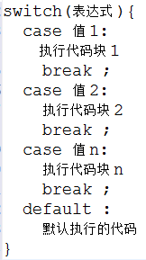
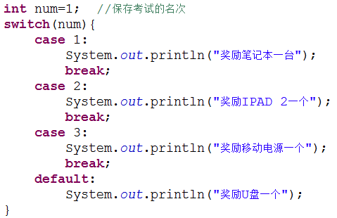
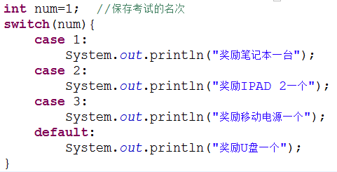

### Switch
语法：



执行过程：当 switch 后表达式的值和 case 语句后的值相同时，从该位置开始向下执行，直到遇到 break 语句或者 switch 语句块结束；如果没有匹配的 case 语句则执行 default 块的代码。



1、 switch 后面小括号中表达式的值必须是整型或字符型

2、 case 后面的值可以是常量数值，如 1、2；也可以是一个常量表达式，如 2+2 ；但不能是变量或带有变量的表达式，如 a * 2

3、 case 匹配后，执行匹配块里的程序代码，如果没有遇见 break 会继续执行下一个的 case 块的内容，直到遇到 break 语句或者 switch 语句块结束 如

运行结果：


4、 可以把功能相同的 case 语句合并起来，如


### While

< 1 >、 判断 while 后面的条件是否成立( true / false )

< 2 >、 当条件成立时，执行循环内的操作代码 ，然后重复执行< 1 >、< 2 >， 直到循环条件不成立为止


### Do While
```java
do{
	循环
}while()
```
<1>、 先执行一遍循环操作，然后判断循环条件是否成立

<2>、 如果条件成立，继续执行< 1 > 、< 2 >，直到循环条件不成立为止

特点： 先执行，后判断

由此可见，do...while 语句保证循环至少被执行一次！


### for
<1>、 执行循环变量初始化部分，设置循环的初始状态，此部分在整个循环中只执行一次

<2>、 进行循环条件的判断，如果条件为 true ，则执行循环体内代码；如果为 false ，则直接退出循环

<3>、 执行循环变量变化部分，改变循环变量的值，以便进行下一次条件判断

<4>、 依次重新执行< 2 >、< 3 >、< 4 >，直到退出循环
