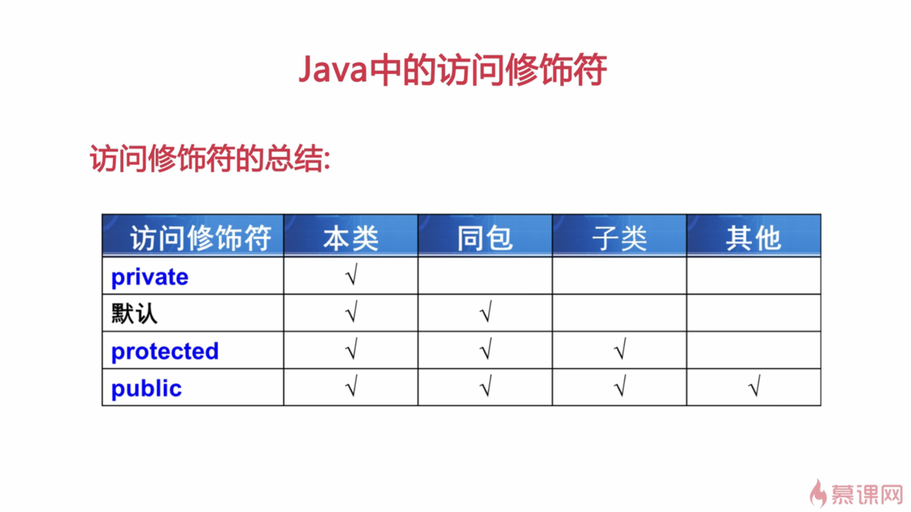
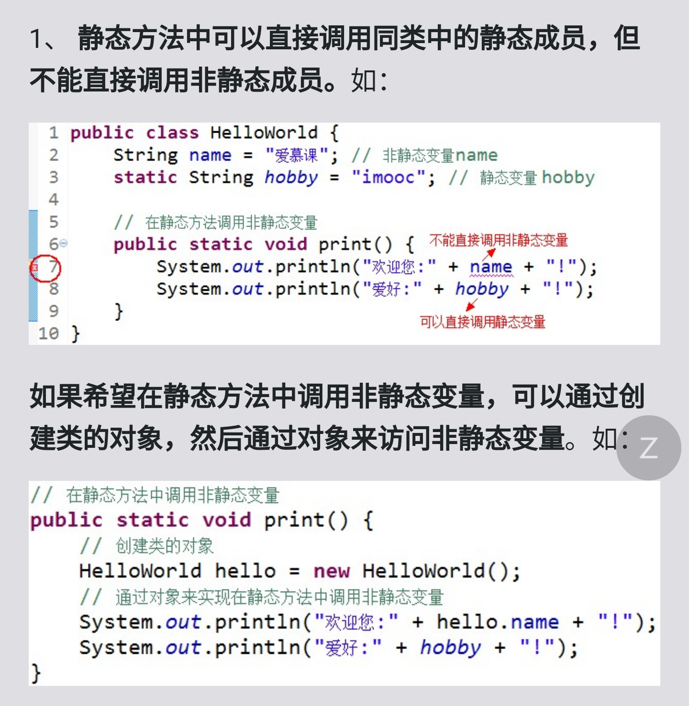
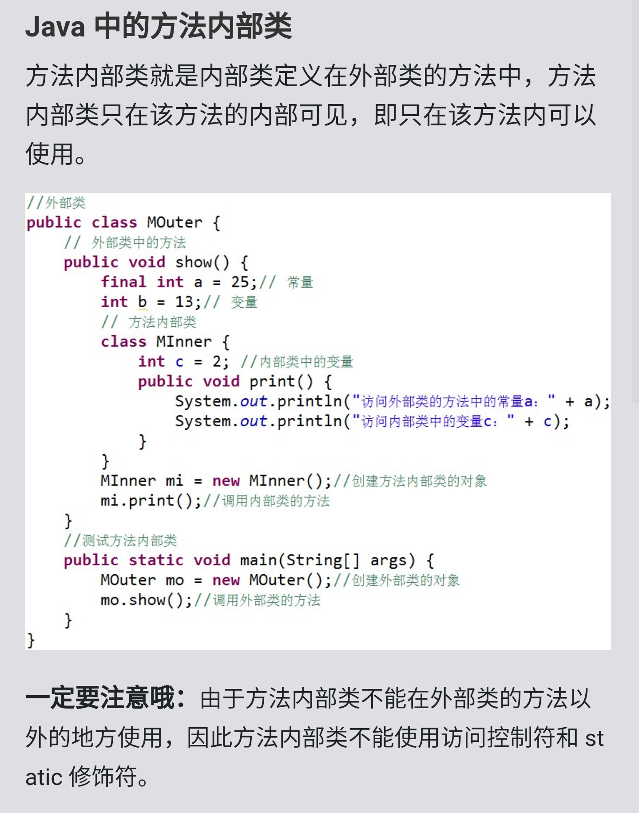

#### 初始化顺序

#### 访问修饰符

#### 静态方法

#### 方法内部类

值类型
    值类型也就是基本数据类型 基本数据类型常被称为四类八种。

四类：1.整型 2.浮点型 3.字符型4.逻辑型

八种：
    1.整型3种： byte，short，int，long；
    2.浮点型2种 ：float，double
    3.字符型1种 ：char
    4.逻辑型1种 ：boolean

（2）引用类型
    除了四类八种基本类型外，所有的类型都称为引用类型（数组，类，接口，字符串）
