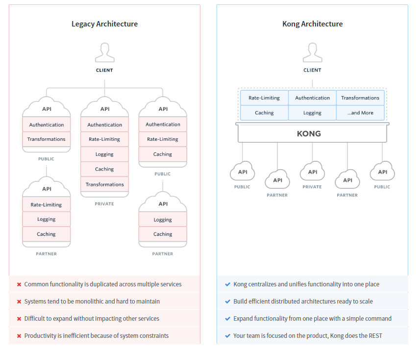

# Kong

基于 Kong 0.13x 版本

## 使用背景

API 网关，即API Gateway，是大型分布式系统中，为了保护内部服务而设计的一道屏障，可以提供高性能、高可用的 API托管服务，从而帮助服务的开发者便捷地对外提供服务，而不用考虑安全控制、流量控制、审计日志等问题，统一在网关层将安全认证，流量控制，审计日志，黑白名单等实现。网关的下一层，是内部服务，内部服务只需开发和关注具体业务相关的实现。网关可以提供API发布、管理、维护等主要功能。开发者只需要简单的配置操作即可把自己开发的服务发布出去，同时置于网关的保护之下。

可以解放开发者去把精力集中在具体逻辑的代码，而不是把时间花费在考虑如何解决应用和其他微服务链接的问题上。

客户端请求 -> 服务器

客户端请求  -> kong       -> 服务器
              访问限制
              流量控制
              分析监控

## 使用效果

客户端在请求服务器的时候直接请求 `kong`服务器的接口，`kong`服务器根据客户端请求的路径、请求头来获取客户端需要实际访问的`api` ，并将请求的参数转发给实际的`api` 

使用前流量传递方式
- client -> server
- server -> client

使用后流量传递方式
- client -> kong
- kong -> server 
- kong -> client