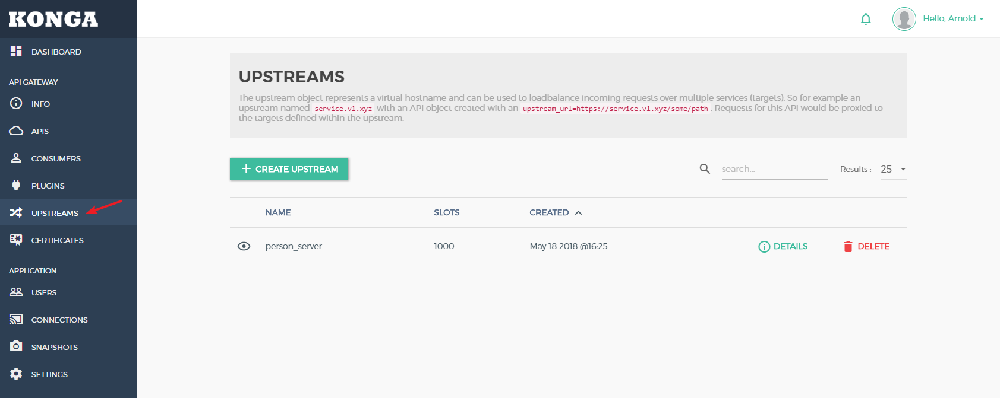
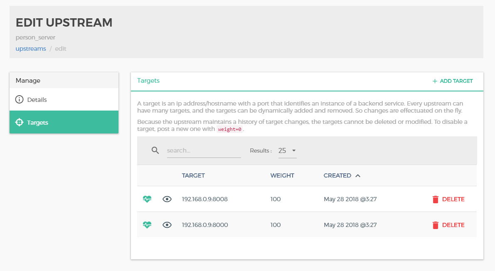
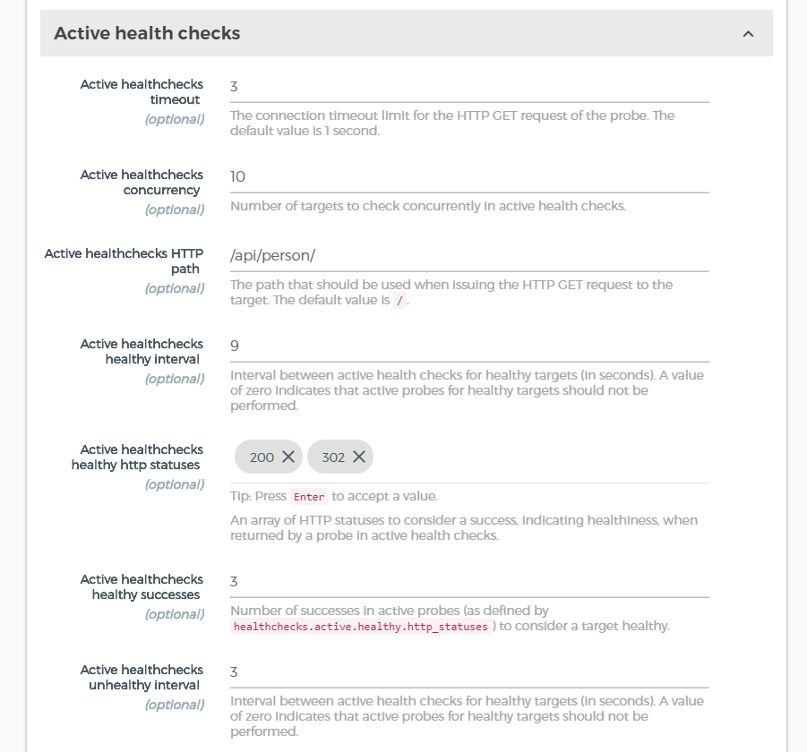
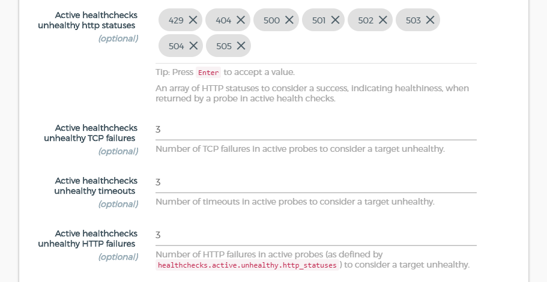
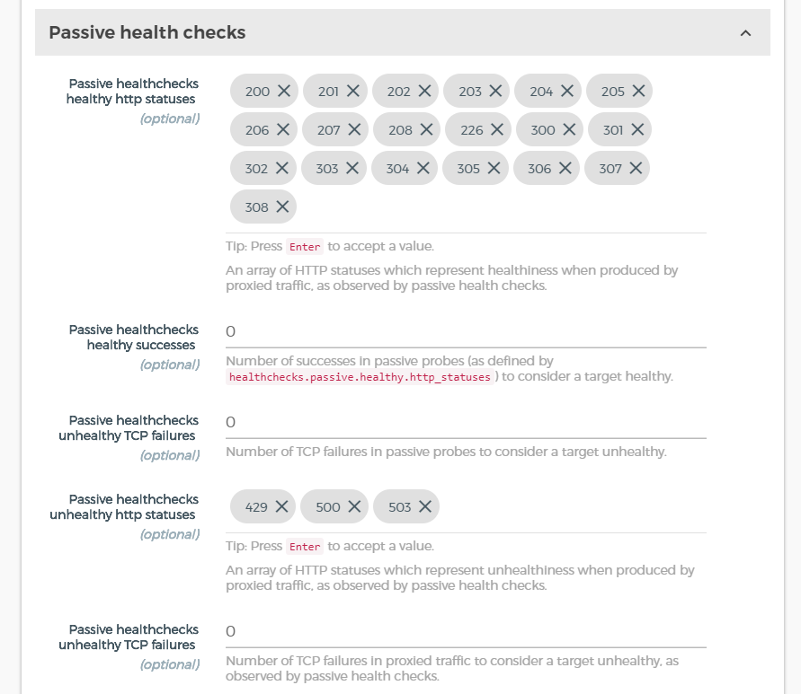
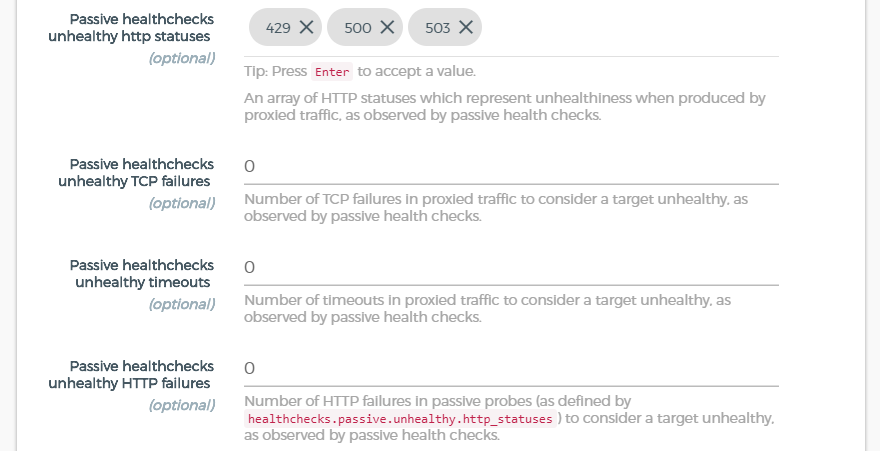

# Kong 负载均衡

在客户端数量庞大时，需要同时运行多个服务器，此时借助于kong框架的请求转发，kong服务器在接受到请求后，服务器在进行处理后去请求实际的api地址，

负载均衡配置信息如下，

先添加上游API 

添加完成后，对 API 中IP，端口部分进行修改，将其替换为负载均衡服务的名字。

在配置好负载均衡后，设置负载均衡的健康检查，通过主动健康检查，当 API 服务器在访问一定次数后仍然返回错误状态码，框架自动将此服务器屏蔽。
主动健康检查配置如下：

- 如果返回的状态码是一个配置为“健康”的状态码，它将递增目标的“成功”计数器并清除所有其他计数器;
- 如果连接失败，它将增加目标的“TCP故障”计数器并清除“成功”计数器;
- 如果超时，它将递增目标的“超时”计数器并清除“成功”计数器;
- 如果返回的状态码被配置为“不健康”，它将递增目标的“HTTP故障”计数器并清除“成功”计数器。

如果任何“TCP故障”，“HTTP故障”或“超时”计数器达到其配置的阈值，目标将被标记为不健康。

如果“Supers”计数器达到其配置的阈值，则目标将被标记为健康。

如果上游的所有目标都不健康，Kong将回应上游的请求503 Service Unavailable

主动健康检查配置

被动健康检查配置

## 相关文档

[健康检查官方文档](https://getkong.org/docs/0.13.x/health-checks-circuit-breakers/)

