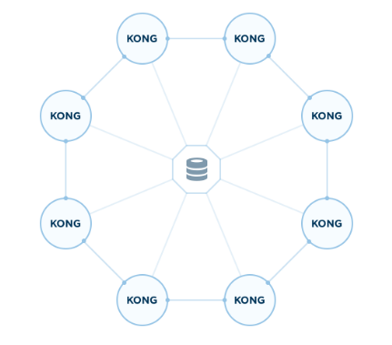

# Kong 集群搭建

当业务量较大时，需要使用多台kong服务器组成集群来，



集群 docker 搭建如下
```sh
sudo docker run -d --name kong-copy \
    -e "KONG_DATABASE=postgres" \
    -e "KONG_PG_DATABASE=db_kong" \
    -e "KONG_PG_USER=user_kong" \
    -e "KONG_PG_PASSWORD=pw_kong" \
    -e "KONG_PG_HOST=192.168.0.9" \
    -e "KONG_PG_PORT=1111" \
    -e "KONG_PROXY_ACCESS_LOG=/dev/stdout" \
    -e "KONG_ADMIN_ACCESS_LOG=/dev/stdout" \
    -e "KONG_PROXY_ERROR_LOG=/dev/stderr" \
    -e "KONG_ADMIN_ERROR_LOG=/dev/stderr" \
    -e "KONG_ADMIN_LISTEN=0.0.0.0:8001" \
    -e "KONG_ADMIN_LISTEN_SSL=0.0.0.0:8444" \
    -p 2221:8000 \
    -p 3332:8443 \
    -p 4443:8001 \
    -p 5554:8444 \
    kong:latest
```

多个集群供用一个数据库，集群在处理数据时，在本地有一个缓存，通过设置`/etc/kong/kong.conf ` 中 `db_update_propagation=5` 来自动更新数据
```sh
#db_update_propagation = 0       # Time (in seconds) taken for an entity in the
                                 # datastore to be propagated to replica nodes
                                 # of another datacenter.
                                 # When in a distributed environment such as
                                 # a multi-datacenter Cassandra cluster, this
                                 # value should be the maximum number of
                                 # seconds taken by Cassandra to propagate a
                                 # row to other datacenters.
                                 # When set, this property will increase the
                                 # time taken by Kong to propagate the change
                                 # of an entity.
                                 # Single-datacenter setups or PostgreSQL
                                 # servers should suffer no such delays, and
                                 # this value can be safely set to 0.
```
验证向 kong 容器中添加API，在 kong-copy中何以同步获取API信息。

