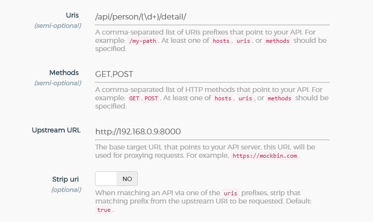

## 添加 API 时正则表达式参数不能正确传递

### 测试命令
```sh
curl -i -X POST --url http://192.168.0.9:4444/apis/  \
   --data 'name=1_device_device_id_status_online'  \
   --data 'uris=/1/device/(\d+)/status/online' \
   --data 'methods=GET,POST' \
   --data 'upstream_url=http://192.168.0.9:8080/1/device/(\d+)/status/online'
```

### 添加效果
```json
{
  "created_at": 1527485816790,
  "strip_uri": true,
  "id": "937e0b8b-14c1-468c-9ad6-b12c8cd1097e",
  "name": "1_device_device_id_status_online",
  "methods": [
    "GET",
    "POST"
  ],
  "http_if_terminated": false,
  "https_only": false,
  "upstream_url": "http://192.168.0.9:8080/1/device/(\\d )/status/online",
  "uris": [
    "/1/device/(\\d )/status/online"
  ],
  "preserve_host": false,
  "upstream_connect_timeout": 60000,
  "upstream_read_timeout": 60000,
  "upstream_send_timeout": 60000,
  "retries": 5
}
```

### 解决方法
使用`requests`进行`API`的添加
```py
def add_api(version: int, handler, methods: tuple = ('GET', 'POST')):
    """
    :param version: url 版本号
    :param handler: url 连接信息
    :param methods: url 允许的请求方式

    todo 默认全部为get+post 后续根据api的详情进行修改
    linux 环境下直接添加api命令格式如下
    curl -i -X POST --url {kong_admin}/apis/ \
               --data 'name={name}' \
               --data 'uris={uris}' \
               --data 'methods={methods}' \
               --data 'upstream_url={upstream_url}' \
               --data 'strip_uri={strip_uri}'
    """
    uris = '/' + str(version) + handler[0]
    name = uris.replace('(\d+)', '-arg-').replace('/', '_').lstrip('_')
    methods = ','.join(methods)
    upstream_url = API_SERVER
    strip_uri = 'false'
    data = {
        'name': name,
        'uris': uris,
        'methods': methods,
        'upstream_url': upstream_url,
        'strip_uri': strip_uri
    }
    server = KONG_ADMIN + '/apis/'
    response = requests.post(server, data)
    logging.info(response)
```


## 在设置负载均衡时，健康检查状态码添加错误

添加状态码时，使用 konga 以及 crul 不能添加新的状态码，目前默认的状态码足够使用，暂时不进行处理。


## 路由参数传递问题

与 tornado 中的路由在配置kong框架uris时，参数传递存在问题，kong 无法获取 tronado 中的路由传递的参数


### 解决方案
设置 strip_uri=false 并将需要传递的参数放在



strip_uri=false 将匹配的路由信息（uris）整个传递给 Upstream URL
strip_uri=true 匹配到路由信息后（uris），直接访问Upstream URL来获取数据


## API Admin 端口暴露

192.168.0.9:4444  地址为 api 的管理地址，此地址设计到 api 的所有操作，应加以访问限制。

### 解决方案

在 Linux 防火墙中添加访问规则限制，只允许此端口在内网访问，

### 参考文档
[Kong官方提供的解决方案](https://getkong.org/docs/0.13.x/secure-admin-api/)
